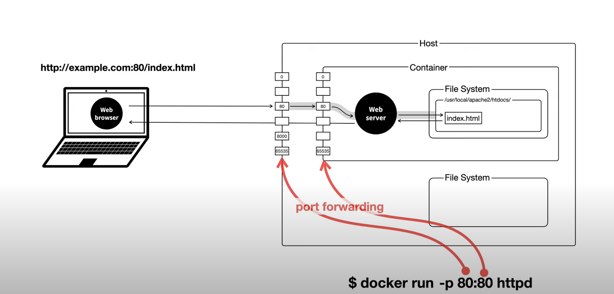

😀도커란 무엇인가?

Docker는 컨테이너 기술을 제공하는 오픈 소스 플랫폼입니다. 컨테이너는 애플리케이션의 배포, 개발, 테스트, 배포 등의 작업을 쉽게 수행할 수 있도록 하는 애플리케이션의 배치 단위입니다. Docker는 개발자가 어플리케이션을 개발할 때 어플리케이션의 의존성, 설정, 라이브러리 등을 포함하여 한 번에 묶어서 배포할 수 있도록 합니다. 이렇게 하면 어플리케이션이 실행되는 환경이 어디서든 동일하게 유지되어 호환성 문제를 해결할 수 있습니다.

* 학습 목표
  * 도커를 설치하고 이미지를 생성하는 방법에대해 학습
  * 이미지를 통해 컨테이너를 만들고 컨테이너와 호스트 포트 포워딩하는 방법 학습
  * 기본적인 도커 명령어를 학습한다. https://docs.docker.com/engine/reference/commandline/docker/  자세한 명령어 레퍼런스는 링크를 확인


**1. 도커 설치**

https://docs.docker.com/get-docker/ 링크에 접속하여 자신에게 맞는 OS 버젼의 도커를 설치합니다.

<div>

</div>

<br>

**2. 도커 실행**

설치가 완료된후 실행 시키면 기본적으로 도커에서 제공하는 GUI를 실행할수 있습니다. 도커는 CLI에서 핸들링할때 그 힘이 더 대단하다고 하지만 아직 도커 명령어와 도커가 익숙하지 않은 저는 큰 차이를 못느끼겠습니다. 이번 학습에서는 GUI와 CLI 다 진행을 통해 도커를 접해보았습니다.

<br>
<div>

</div>
<br>

<br>

**3. 이미지 생성**
 
 자신이 사용할 image를 pull 해줍니다. 여기서 이미지는 쉽게 말해 자신이 원하는 프로그램을 다운로드 한다고 생각하면 되겠습니다. (docke) image-> program, pull -> download 

 2) CLI
   * docker pull [imagename]
  

  1) GUI
  <div>
  
  </div>
     *  pull 버튼을 클릭하여 이미지를 받으면 되겠습니다.

<br>
설치가 잘되었는지 확인하기 위해 현재 설치된 image 리스트를 확인해줍시다.

docker images 명령어를 통해 현재 설치된 이미지를 볼수있습니다.


**4. container 생성.**

기본적으로 container를 생성하는 ```docker run [OPTIONS] IMAGE [COMMAND] [ARG...][image]```
명령어를 통해 컨테이너를 생성할 수 있습니다. 생성된 컨테이너를  ```docker ps``` 명령어를 통해 현재 실행되고 있는 컨테이너를 확인할 수 있습니다.


여러개의 이미지를 생성할시 ```--name``` 옵션을 주어 컨테이너에 이름을 부여하여 구별할수 있도록 해줍시다. 이름을 부여하지 않으면 기본적으로 도커개발자들이 만들어놓은 여러가지 재미난 이름이 붙는것 같다. 위에 보면 이름을 따로 부여하지 않았지만 우아한 앨런이 컨테이너 이름에 붙었다.. 뭐 중요한건 아님

이렇게 실행되는 컨테이너를 멈추는 명령어는 ```docker stop [이미지 이름]```을 입력하면된다.


***위에서 부터 천천히 명령어를 보면**

1) ```docker ps```를 통해 현재 실행되고 있는 bellcold라는 컨테이너를 확인할수 있다.
2) ```docker stop bellcold```를 통해 컨테이너를 종료
3) ```docker ps```를 통해 컨테이너가 정상적으로 종료된것을 확인 할수 있다. 그렇다고 컨테이너가 삭제가 된것이 아닙니다.
4) ```docker ps -a``` -a 옵션을 통해 컨테이너가 여전히 있음을 확인 할수 있습니다.
5) ```docker rm [컨테이너 이름]```을 통해 컨테이너를 삭제할수 있습니다.

**5. host와 container port 포워딩**

컨테이너와 호스트와의 기본적인 구조를 보면 (자료출처: 생활코딩 이고잉님)
<div>

</div>

나는 쉽게 이렇게 생각 했다. 우리가 평소 web server를 실행하고 자연스레 local환경에서 8080으로 웹서버를 실행 했었다. 그런 환경을 컨테이너로 한번 더 감싸안았기 때문에 그 내부의 웹서버와 호스트를 서로 싱크를 맞춰준다라고 편하게 생각했다. 다음은 명령어를 통해 호스트와 컨테이너르 포트포워딩하여 생성하는 방법을 보겠습니다.

<br>

포트의 설정은 기본적으로 ```-p``` 옵션과 호스트의 포트번호 : 컨테이너의 포트번호를 맞춰주면 된다 일반적으로 컨테이너 포트번호는 80으로 셋팅 되어있다.


<br>

host의 8080 port number와 containerdml port number가 연결된걸 알수있다.


(이 html은 도커 httpd에서 기본적으로 설정되어있는 index.html입니다)
정상적으로 호스트에 넘버를 통해 컨테이너 내부에 있는 파일을 잘 읽어 왔음을 확인할 수있다.


<br>
정상적인 http 요청이 들어온 것을 확인할수있다.